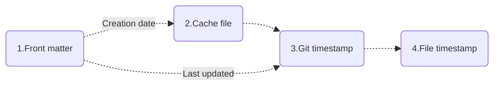
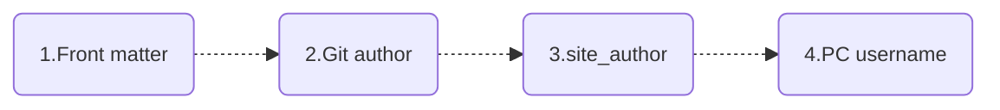
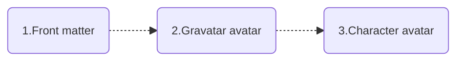

# Add document dates & authors

<!-- md:version 10.0.4 -->
<!-- md:plugin [document-dates] -->

You can add date and author information to your documents via the plugin [document-dates], a new generation MkDocs plugin for displaying exact **creation date, last updated date, authors, email** of documents


  [document-dates]: https://github.com/jaywhj/mkdocs-document-dates

## Features

- Always displays **exact** meta information of the document and works in any environment (no-Git, Git environments, Docker, all CI/CD build systems, etc.)
- Support list display of recently updated documents (in descending order of update date)
- Support for manually specifying date and author in `Front Matter`
- Support for multiple date formats (date, datetime, timeago)
- Support for multiple author modes (avatar, text, hidden)
- Support for manually configuring author's name, link, avatar, email, etc.
- Flexible display position (top or bottom)
- Elegant styling (fully customizable)
- Multi-language support, localization support, intelligent recognition of user language, automatic adaptation
- **Ultimate build efficiency**: O(1), no need to set the env var `!ENV` to distinguish runs

    | Build Speed Comparison:     | 100 md: | 1000 md: | Time Complexity: |
    | --------------------------- | :-----: | :------: | :----------: |
    | git-revision-date-localized<br /><br />git-authors |  <br />＞ 3 s   |  <br />＞ 30 s   |    <br />O(n)    |
    | document-dates              | ＜ 0.1 s  | ＜ 0.15 s  |    O(1)     |

## Installation

Install it with `pip`:

```bash
pip install mkdocs-document-dates
```

Then, add the following lines to `mkdocs.yml`:

```yaml
plugins:
  - document-dates
```

Or, common configuration:

```yaml
plugins:
  - document-dates:
      position: top            # Display position: top(after title) bottom(end of document), default: top
      type: date               # Date type: date datetime timeago, default: date
      exclude:                 # List of excluded files
        - temp.md                  # Example: exclude the specified file
        - blog/*                   # Example: exclude all files in blog folder, including subfolders
```

## Configuration

The following configuration options are supported:

<!-- md:option document-dates.position -->

:   <!-- md:default `top` --> This option specifies the display position of the plugin. 
    Valid values are `top`, `bottom`:

    ```yaml
    plugins:
      - document-dates:
          position: top
    ```

<!-- md:option document-dates.type -->

:   <!-- md:default `date` --> This option specifies the type of date to be displayed.
    Valid values are `date`, `datetime`, `timeago`:

    ```yaml
    plugins:
      - document-dates:
          type: date
    ```

<!-- md:option document-dates.exclude -->

:   <!-- md:default none --> This option specifies a list of excluded files:

    ```yaml
    plugins:
      - document-dates:
          exclude:
            - temp.md   # Example: exclude the specified file
            - blog/*    # Example: exclude all files in blog folder, including subfolders
    ```

<!-- md:option document-dates.date_format -->

:   <!-- md:default `%Y-%m-%d` --> This option specifies the date formatting string:

    ```yaml
    plugins:
      - document-dates:
          date_format: '%Y-%m-%d'   # e.g., %Y-%m-%d, %b %d, %Y
          time_format: '%H:%M:%S'   # valid only if type=datetime
    ```
  
  <!-- md:option document-dates.show_created -->

:   <!-- md:default `true` --> This option specifies whether to display the creation date.
    Valid values are `true`, `false`:

    ```yaml
    plugins:
      - document-dates:
          show_created: true
    ```

<!-- md:option document-dates.show_updated -->

:   <!-- md:default `true` --> This option specifies whether to display the last updated date.
    Valid values are `true`, `false`:

    ```yaml
    plugins:
      - document-dates:
          show_updated: true
    ```

<!-- md:option document-dates.show_author -->

:   <!-- md:default `true` --> This option specifies the type of author display.
    Valid values are `true`(avatar), `false`(hidden), `text`(text):

    ```yaml
    plugins:
      - document-dates:
          show_author: true   # true(avatar) text(text) false(hidden)
    ```

  [document-dates]: https://github.com/jaywhj/mkdocs-document-dates

## Specify datetime

### Priority

The plugin will **automatically** loads the exact date of the document in the following order



<!--
- [x] Creation date: `Front matter` > `Cache file` > `Git timestamp` > `File timestamp`
- [x] Last updated: `Front matter` > `Git timestamp` > `File timestamp`
-->

!!! quote ""

    === "Creation date"
    
        1. Prioritize reading the custom creation date in front matter
        2. Then read the creation date in the cache file
        3. Next read the document’s first git commit date as the creation date
        4. Finally read the file’s creation time
    
    === "Last updated"
    
        1. Prioritize reading the custom last updated date in front matter
        2. Then read the document’s last git commit date as the last updated date
        3. Finally read the file’s modification time

### Customization

This can be specified manually in front matter using the following fields

- Creation date: `created`, `date`
- Last updated: `updated`, `modified`

```yaml
---
created: 2023-01-01
updated: 2025-02-23
---
```

### Automatic cache creation date

The plugin automatically caches the creation date (no need to cache the last updated date), here's how it works:

1) In order to always get the original creation date of the document (earlier than the first git commit), a cache file is used to store the original creation date, located in the docs folder (hidden by default), please don't remove it:

- `docs/.dates_cache.jsonl`, cache file
- `docs/.gitattributes`, merge mechanism for cache file

2) The Git Hooks mechanism is used to automatically trigger the storing of the cache (on each `git commit`), and the cached file is automatically committed along with it, in addition, the installation of Git Hooks is automatically triggered when the plugin is installed, without any manual intervention

- Make sure you run `git commit` from a terminal, not from integration tools like VSCode, which has bugs when integrating Git hooks
- If you find that the hook auto-installation fails, you can also use this command to install it manually: `mkdocs-document-dates-hooks`

Fallback: If the cached file doesn't exist or automatic caching fails, the creation date will not be affected, it will proceed to priority 3 (read the first git commit date as the creation date)

### Configure git fetch depth

If the "creation date" is the date of the first git commit (i.e., when no custom creation date and cache file creation date are available), and you are deploying through a CI system, you might need to configure the git fetch depth in the CI system to retrieve the accurate record of the first git commit, for example:

```yaml hl_lines="6 7"
jobs:
  deploy:
    runs-on: ubuntu-latest
    steps:
      - uses: actions/checkout@v4
        with:
          fetch-depth: 0
```

!!! quote ""

    - Github Actions: set `fetch-depth` to `0` ([docs](https://github.com/actions/checkout))
    - Gitlab Runners: set `GIT_DEPTH` to `0` ([docs](https://docs.gitlab.com/ee/ci/pipelines/settings.html#limit-the-number-of-changes-fetched-during-clone))
    - Bitbucket pipelines: set `clone: depth: full` ([docs](https://support.atlassian.com/bitbucket-cloud/docs/configure-bitbucket-pipelinesyml/))
    - Azure Devops pipelines: set `Agent.Source.Git.ShallowFetchDepth` to something very high like `10e99` ([docs](https://docs.microsoft.com/en-us/azure/devops/pipelines/repos/pipeline-options-for-git?view=azure-devops#shallow-fetch))

### Adaptive to any environment

The plugin can get the original exact date of the document in any environment, supports no-Git environments, Git environments, Docker, all CI/CD build systems, etc., here's how it works:

1. Adopt File Timestamp: ensure that the original exact date can be obtained in a local no-Git environment
2. Adopt Git Timestamp: ensure that the relatively accurate date can be obtained in a Git environment
3. Adopt Cache File: ensure that the original absolutely exact date can be obtained in a Git environment
4. Front Matter: if you don't want to use automated dates, you can perform personalized customization in front matter

## Specify author

### Priority

The plugin will **automatically** loads the author information of the document in the following order, and will automatically parse the email and then do the linking



<!--
- [x] `Front matter` > `Git author` > `site_author(mkdocs.yml)` > `PC username`
-->

!!! quote ""

    === "Description"
    
        1. Prioritize reading custom authors in front matter
        2. Then read the git author
        3. Next read the site_author in mkdocs.yml
        4. Finally read the PC username

### Customization

Can be configured in front matter in the following ways:

1) Configure a simple author: via field `name`

```yaml
---
name: any-name
email: e-name@gmail.com
---
```

2) Configure one or more authors: via field `authors`

```yaml
---
authors:
  - jaywhj
  - dawang
  - sunny
---
```

### Enhanced author configuration

For a better user experience, you can add full configuration for all authors. To do so, create an `authors.yml` file in the `docs/` folder using the format below:

```yaml title="docs/authors.yml"
authors:
  jaywhj:
    name: Aaron Wang
    avatar: https://xxx.com/avatar.jpg
    url: https://jaywhj.netlify.app/
    email: junewhj@qq.com
    description: Minimalism
  user2:
    name: xxx
    avatar: assets/avatar.png
    url: https://xxx.com
    email: xxx@gmail.com
    description: xxx
```

When the author name in `Front matter`, `Git author`, `site_author(mkdocs.yml)` matches the key in `authors`, the full author information of the key will be automatically loaded

### Git author aggregation

Git author support account aggregation, i.e. multiple different email accounts for the same person can be aggregated to show the same author, which can be configured by providing a `.mailmap` file in the repository root directory, this is also a feature of Git itself, see [gitmailmap](https://git-scm.com/docs/gitmailmap) for more details

The following example aggregates a gmail account into a qq account and displays it uniformly as Aaron:

```yaml title=".mailmap"
Aaron <junewhj@qq.com> <aaron@gmail.com>
```

## Specify avatar

**Priority**: The plugin will **automatically** loads the author avatar in the following order



<!--
- [x] `Front matter` > `Gravatar avatar` > `Character avatar`
-->

**Customization**: 

Customizable via `avatar` field in [Enhanced author configuration](#enhanced-author-configuration) (supports URL paths and local file paths)

**Others**：

!!! quote ""

    === "Gravatar avatar"
    
        Load from Gravatar or Weavatar based on Git's `user.email`
    
    === "Character avatar"
    
        Automatically generated based on the author's name with the following rules:

        1. Extract initials: English takes the combination of initials, other languages take the first character
        2. Generate dynamic background color: Generate HSL color based on the hash of the name

## Structure and style

You can configure the display structure of the plugin in the following ways in either mkdocs.yml or front matter

### Configuration structure

**Global toggle**, configured in mkdocs.yml:

```yaml
plugins:
  - document-dates:
      ...
      show_created: true    # Show creation date: true false, default: true
      show_updated: true    # Show last updated date: true false, default: true
      show_author: true     # Show author: true(avatar) text(text) false(hidden), default: true 
```

**Local toggle**, configured in front matter (using the same field names):

```yaml
---
show_created: true
show_updated: true
show_author: text
---
```

!!! tip "Note"

    When used in combination, the global toggle acts as the master switch, and the local toggle only takes effect when the master switch is enabled. This does not follow the logic of local configurations overriding global ones.

### Configuration style

You can quickly set the plugin styles through preset entrances, such as **icons, themes, colors, fonts, animations, dividing line** and so on, you just need to find the file below and uncomment it:

|        Category:        | Location:                  |
| :----------------------: | -------------------------- |
|     **Style & Theme**     | docs/assets/document_dates/user.config.css |
| **Properties & Functions** | docs/assets/document_dates/user.config.js |

You can also refer to the latest example file for free customization: [user.config](https://github.com/jaywhj/mkdocs-document-dates/tree/main/mkdocs_document_dates/static/config)

## Use template variables

You can use the following variables in the template to access the document's meta-info:

- page.meta.document_dates_created
- page.meta.document_dates_updated
- page.meta.document_dates_authors
- config.extra.recently_updated_docs

### Set correct `lastmod` for sitemap

You can set the correct `lastmod` for your site's `sitemap.xml` with the template variable `document_dates_updated` so that search engines can better handle SEO and thus increase your site's exposure

Step: Download the sample template [sitemap.xml](https://github.com/jaywhj/mkdocs-document-dates/blob/main/templates/overrides/sitemap.xml), and override this path `docs/overrides/sitemap.xml`

### Recustomize plugin

The plugin can be re-customized using templates, you have full control over the rendering logic and the plugin is only responsible for providing the data

Step: Download the sample template [source-file.html](https://github.com/jaywhj/mkdocs-document-dates/blob/main/templates/overrides/partials/source-file.html), and override this path `docs/overrides/partials/source-file.html`, then freely customize the template code

## Add recent updates module

The recent updates module is perfect for sites **with a large number of documents**, so that **readers can quickly see what's new**.


You can get the recently updated document data (in descending order of update date) in any template via the variable `config.extra.recently_updated_docs`, then customize the rendering logic yourself

Or refer to the documentation [Recent updates module](adding-recent-updates-module.md) to use the preset template:

- Display recently updated documents in descending order by update time, list items are dynamically updated
- Support multiple view modes including list, detail and grid
- Support automatic extraction of article summaries
- Support for customizing article cover in Front Matter

## Add localized languages

The plugin's `tooltip` and `timeago` have built-in multi-language support, and the `locale` is automatically detected, so you don't need to configure it manually. If any language is missing, you can add it for them:

**tooltip**

Built-in locales: `en zh zh_TW es fr de ar ja ko ru nl pt`

Addition Method (choose one): 

- In `user.config.js`, refer to [Part 3](https://github.com/jaywhj/mkdocs-document-dates/blob/main/mkdocs_document_dates/static/config/user.config.js) to add it by registering yourself
- Submit a PR for Inclusion

**timeago**

When `type: timeago` is set, the timeago.js library is enabled for dynamic time rendering. The built-in locales in `timeago.min.js` only include `en zh`. If you need to load other languages, you can configure it as described below (choose one):

- In `user.config.js`, refer to [Part 2](https://github.com/jaywhj/mkdocs-document-dates/blob/main/mkdocs_document_dates/static/config/user.config.js) to add it by registering yourself
- In `mkdocs.yml`, configure the full version of `timeago.full.min.js` to reload [all locales](https://github.com/hustcc/timeago.js/tree/master/src/lang)
  ```yaml
  extra_javascript:
    - assets/document_dates/core/timeago.full.min.js
  ```

## Other tips

When running in Docker, you need to set the HOME environment variable first, because installing Git Hooks requires a writable user configuration directory. For example, add the following configuration to your `docker-compose.yml`:

```yaml
environment:
  - HOME=/docs
working_dir: /docs
volumes:
  - ./mkdocs:/docs    # Mount the host's ./mkdocs to /docs in the container
```
